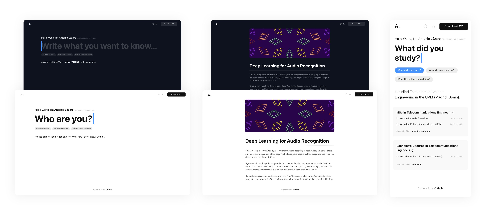

<p align="center">
  <a href="https://www.gatsbyjs.com/?utm_source=starter&utm_medium=readme&utm_campaign=minimal-starter-ts">
    
  </a>
</p>
<h1 align="center">
  Personal Website
</h1>
<p align="center">
  The first version of personal website
</p>



## Set Up

1. Install the Gatsby CLI.

   ```shell
   npm install -g gatsby-cli
   ```

2. Install the correct version of Node using NVM.

   ```shell
   nvm install
   ```

3. Install dependencies.

   ```shell
   npm install
   ```

4. Start development server.

   ```shell
   npm start
   ```
